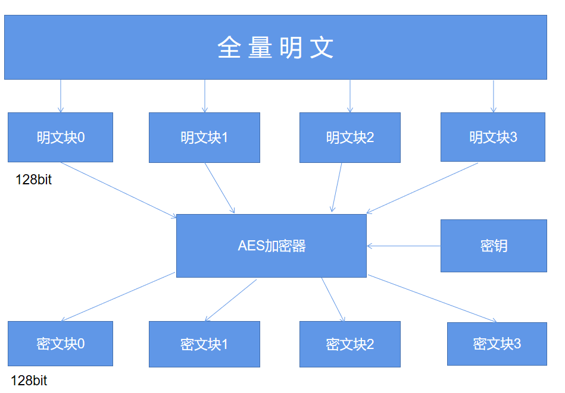

"""
参考文章 : https://www.sohu.com/a/561300734_568359

AES的全称是Advanced Encryption Standard，是DES算法的替代者，也是当今最流行的对称加密算法之一。
想要弄清楚AES算法，首先就得弄明白三个基本的概念：密钥、填充和模式。

- 密钥 
  - 大家可以将其想象成是一把钥匙，既可以用其来进行上锁，可以用其来进行解锁。AES支持三种长度的密钥：128位、192位以及256位。

- 填充 
  - 而至于填充这一概念，AES的分组加密的特性我们需要了解，具体如下图所示

  - 简单来说，AES算法在对明文加密的时候，并不是把整个明文一股脑儿地加密成一整段密文，而是把明文拆分成一个个独立的明文块，每一个明文块的长度为128比特。
这些明文块经过AES加密器的复杂处理之后，生成一个个独立的密文块，将这些密文块拼接到一起就是最终的AES加密的结果了。
  - 那么这里就有一个问题了，要是有一段明文的长度是196比特，如果按照每128比特一个明文块来拆分的话，第二个明文块只有64比特了，不足128比特该怎么办呢？这个时候就轮到填充来发挥作用了，默认的填充方式是PKCS5Padding以及ISO10126Padding。
  - 不过在AES加密的时候使用了某一种填充方式，解密的时候也必须采用同样的填充方式。
- 模式
  - AES的工作模式，体现在了把明文块加密成密文块的处理过程中，主要有五种不同的工作模式，分别是CBC、ECB、CTR、CFB以及OFB模式，同样地，如果在AES加密过程当中使用了某一种工作模式，解密的时候也必须采用同样地工作模式。最后我们用Python来实现一下AES加密
- CBC模式
  - CBC模式是最常用的工作模式，它需要一个初始化向量IV，这个IV需要和密钥一样，是一个随机数，IV的长度和密钥长度一样，这里我们使用16个字节的IV，也就是128比特。
